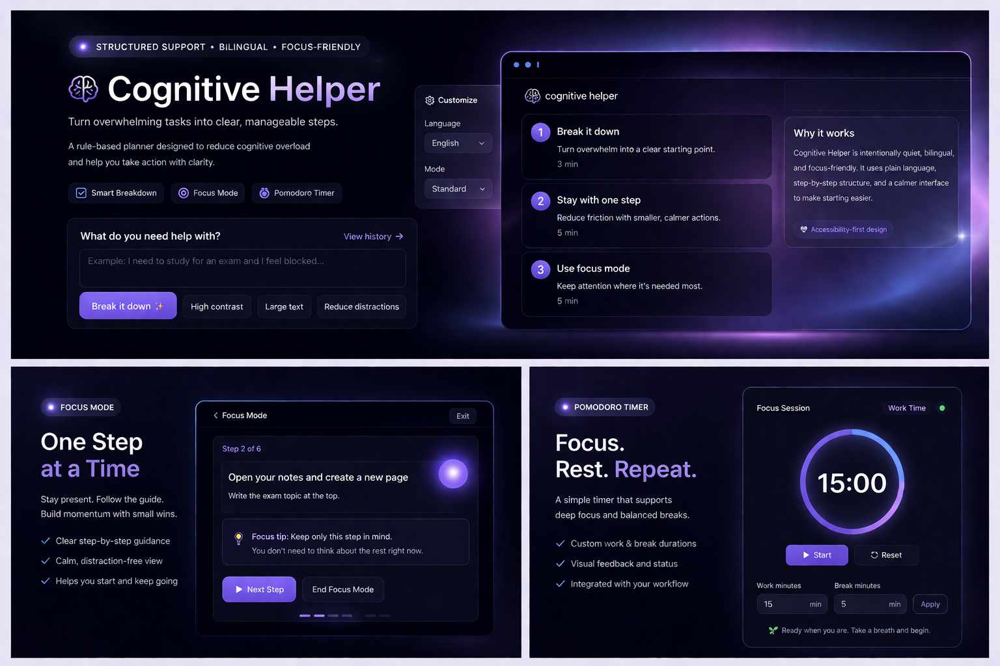
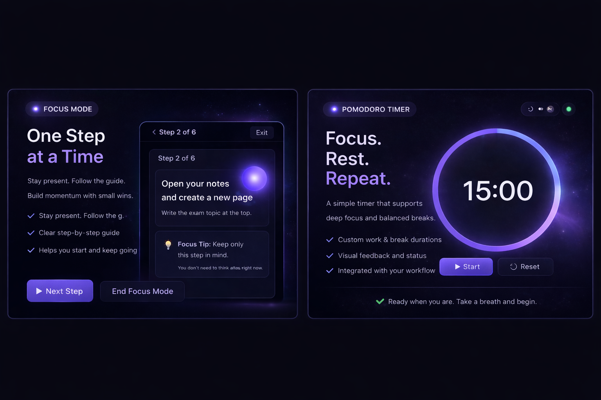

# 🧠 Cognitive Helper

<p align="center">
  
</p>

<p align="center">
  
  
  
  
  
</p>

---

### 🚀 Structured support for overwhelming tasks  
### 🚀 Soporte estructurado para tareas abrumadoras  

A calm, step-by-step tool designed to reduce cognitive overload and help users take action.  
Una herramienta simple y guiada para reducir la carga mental y facilitar el inicio.

---

## ✨ Core

- Break tasks into **clear starting points**  
- Guide execution **one step at a time**  
- Support focus with **built-in tools**  
- Reduce friction, not add complexity  

---

## 🎯 Experience

<p align="center">
  
</p>

- Focus Mode → one action at a time  
- Pomodoro Timer → structured work blocks  
- Visual guidance → calm, minimal interface  

---

## 🌍 Bilingual & Accessible

- English / Spanish  
- High contrast  
- Large text  
- Reduced distractions  

---

## 🛠️ Stack

Flask · Python · HTML · CSS · JavaScript  
Rule-based logic (no AI dependency)

---

## 🧠 Concept

> Not about productivity.  
> About making it easier to start.

> No se trata de productividad.  
> Se trata de poder empezar.

---

## 🚀 Run

```bash
git clone https://github.com/bentancourtfiorellanahir-bot/cognitive-helper.git
cd cognitive-helper

python3 -m venv venv
source venv/bin/activate
pip install -r requirements.txt
python3 app.py
